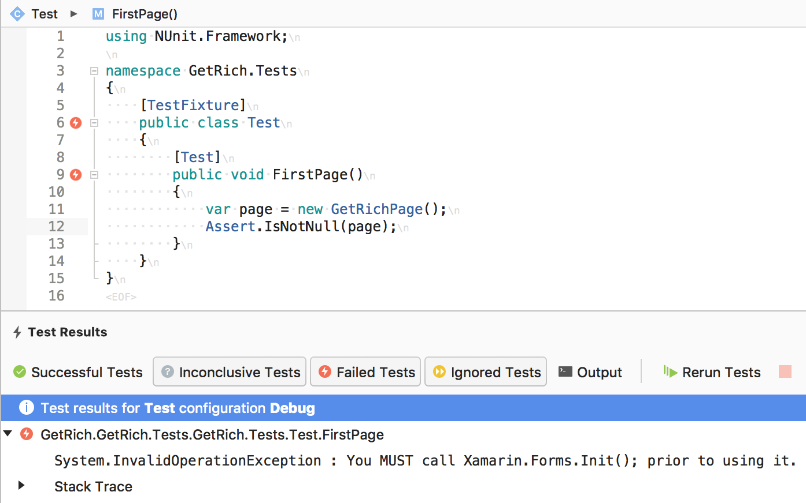

# Xamarin.Forms.Mocks
Library for running Xamarin.Forms inside of unit tests

If you've ever written any complicated logic inside a Xamarin.Forms View, you quickly realize that this code can't be unit tested easily.

You probably hit something like this and then give up:


You can now install [this package](https://www.nuget.org/packages/Xamarin.Forms.Mocks/) from NuGet and get past this issue:
```csharp
[SetUp]
public void SetUp()
{
    Xamarin.Forms.Mocks.MockForms.Init();
}
```

So you can even do things like load XAML dynamically:
```csharp
using Xamarin.Forms.Xaml;
//...
[Test]
public void LoadFromXaml()
{
    var label = new Label();
    label.LoadFromXaml("<Label Text=\"Woot\" />");
    Assert.AreEqual("Woot", label.Text);
}
```

You can unit test navigation:
```csharp
[Test]
public async Task Push()
{
    var root = new ContentPage();
    var page = new ContentPage();
    await root.Navigation.PushAsync(page);
    Assert.AreEqual(root.Navigation.NavigationStack.Last(), page);
}
```

You can unit test animations:
```csharp
[Test]
public async Task FadeTo()
{
    var view = new BoxView();
    await view.FadeTo(0);
    Assert.AreEqual(0, view.Opacity);
}
```

# How does it work?

The main issue with trying to call `Xamarin.Forms.Init()` yourself for unit testing is that all kinds of interfaces and classes are marked `internal`. I get around this by conforming to `[InternalsVisibleTo]` which is declared for the purposes of unit testing Xamarin.Forms itself.

I merely named the output assembly `Xamarin.Forms.Core.UnitTests.dll`, and the `MockForms` class is able to call internal stuff all it wants. Just remember marking something `internal` does not mean someone tricky can't call it if they are determined enough.

I patterned after unit tests in Xamarin.Forms itself to figure out how to most easily mock everything.

# Notes

`Device.BeginInvokeOnMainThread` is currently just synchronous. This may not be desired, but is the quickest plan for now.

All animations will just complete immediately. Just `await` them and use `async` unit tests.

I tested everything with NUnit, but nothing is tied specifically to it. Things should work find if you want to use a different unit testing library.
